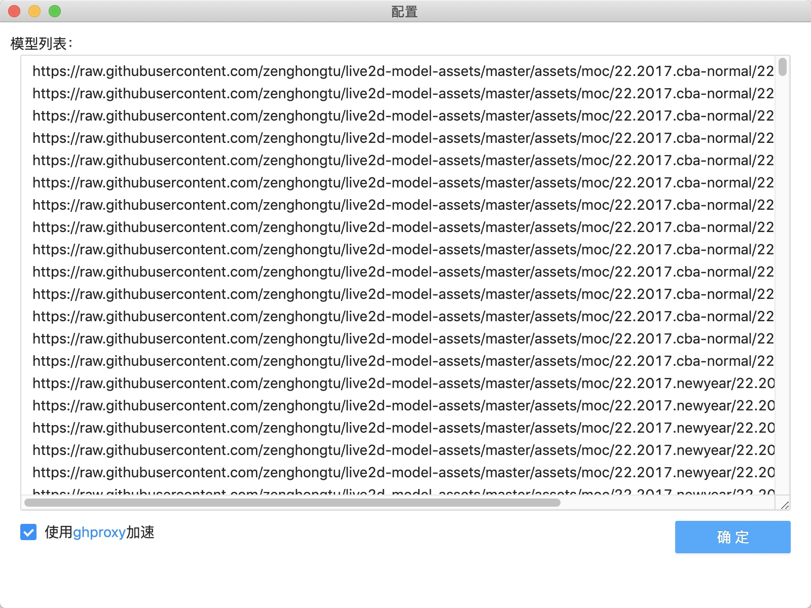
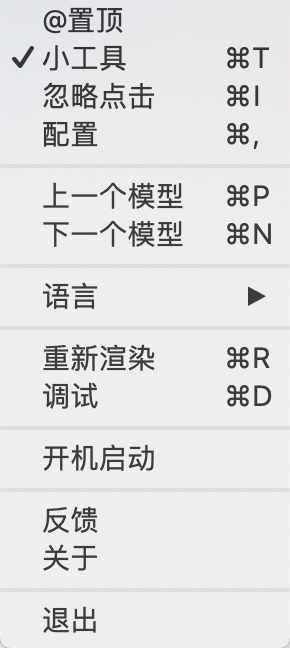
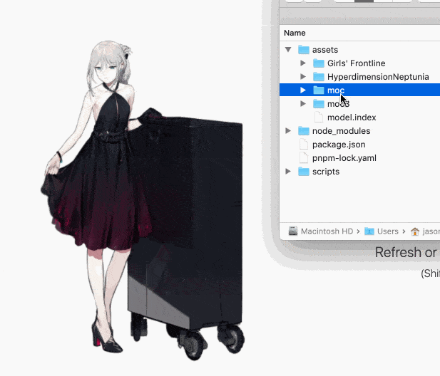

**支持 Live2d v3 啦~**

## 预览


设置（可以使用在线/本地 Model）：



托盘：



## 功能

- [x] 支持 Live2d v2/v3
- [x] 导入本地/在线 Model
- [x] 调整渲染大小
- [x] @置顶
- [x] 忽略点击
- [x] 开机启动
- [x] 拖动位置
- [ ] ...

## 安装

[这里]()去下载最新版本，Mac 使用.dmg， Window 使用.exe，Linux 使用.deb。

（可以使用 [GitHub Proxy 代理加速](https://ghproxy.com/) 下载）

## 使用

### 导入模型

两种方式：

- 在设置 -> 模型列表中添加 `json` 文件（本地模型以`file://`开头）。

- 本地模型将文件夹拖入窗口中，导入成功会更新到模型列表中



## 开发

```
$ pnpm i
$ pnpm start
```
